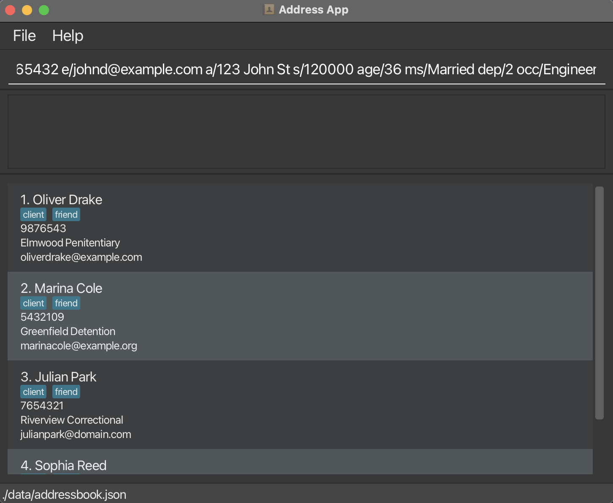

# ClientCore
 
ClientCore offers a comprehensive desktop application for financial advisors to manage their clients efficiently. It is optimized for tech-savvy financial advisors who need to handle a large number of client profiles, enabling them to reduce administrative work and focus on delivering personalised financial advice.

## Features

ClientCore allows users to:

* Add, view, edit, and delete client profiles.
* Store detailed client information including name, contact details, salary, and age range.
* Find and filter for clients using the above criteria.
* View a summary of each client's information at a glance.
* Sort clients based on different criteria.

## Other Details

* This project is based on the AddressBook-Level3 project created by the [SE-EDU initiative](https://se-education.org).

