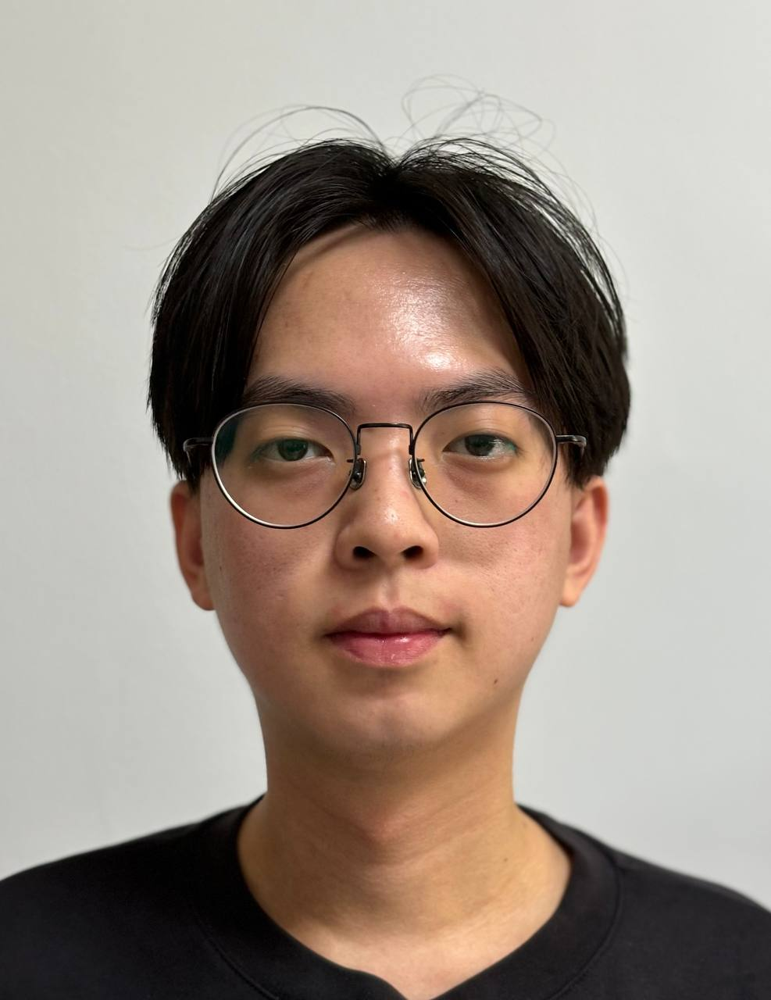
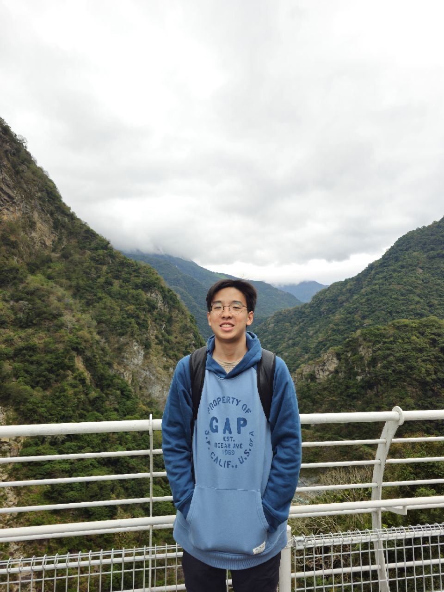
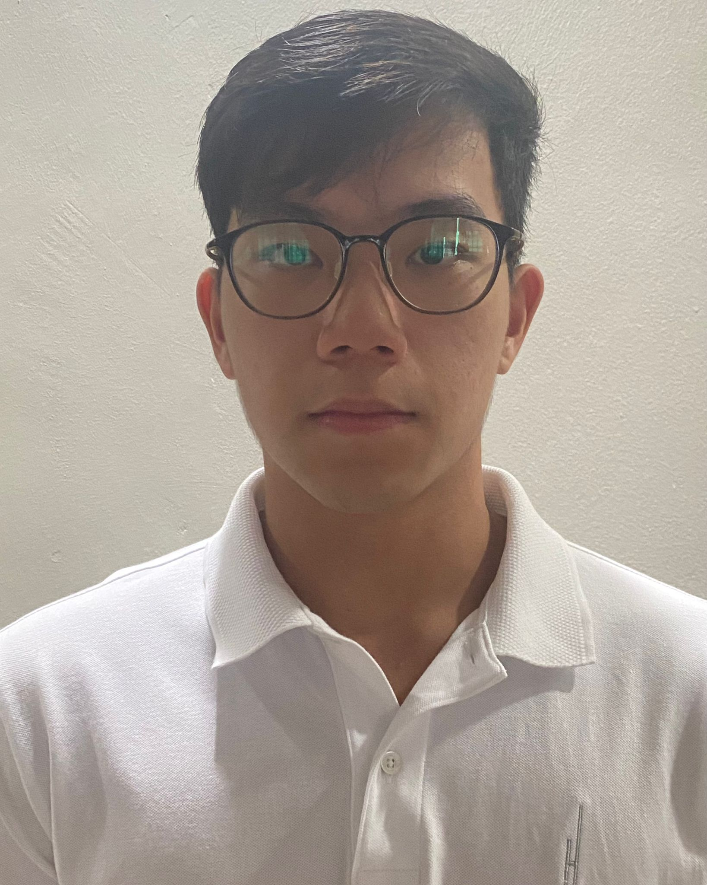
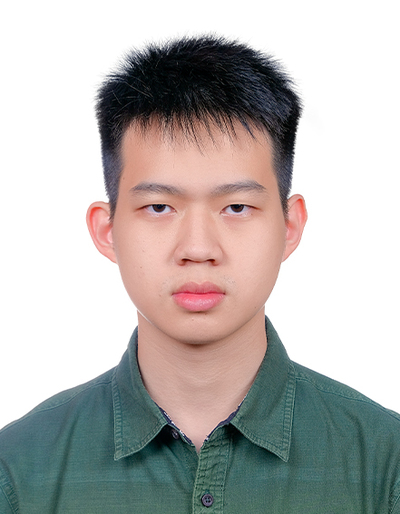

We are a team based in the [School of Computing, National University of Singapore](https://www.comp.nus.edu.sg).

You can reach us at the email `seer[at]comp.nus.edu.sg`

## Project team

### Lim Wee Kit

[[homepage](http://www.comp.nus.edu.sg/~damithch)]
[[github](https://github.com/johndoe)]
[[portfolio](team/johndoe.md)]

* Role: Testing

### Jun Duan

[[github](http://github.com/owjd03)]
[[portfolio](team/johndoe.md)]

* Role: Developer
* Responsibilities: Documentation

### Matthias Yim

[[github](http://github.com/matthias890)] [[portfolio](team/johndoe.md)]

* Role: Developer
* Responsibilities: Code Quality

### Thia Yi Hong

[[github](http://github.com/yhthia)]
[[portfolio](team/johndoe.md)]

* Role: Developer
* Responsibilities: Scheduling and tracking

### Vigo King

[[github](http://github.com/vrospix)]
[[portfolio](team/johndoe.md)]

* Role: Integration
* Responsibilities: Code maintaining
