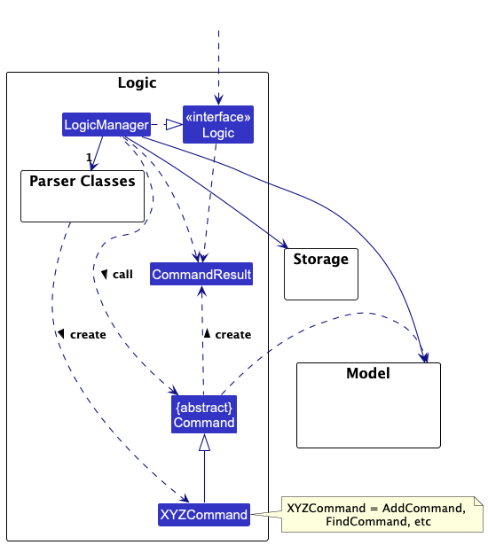
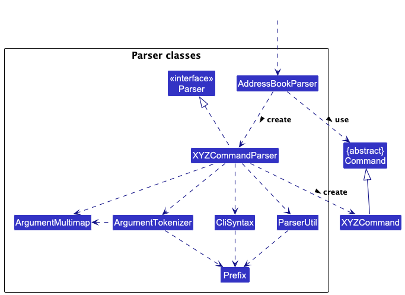
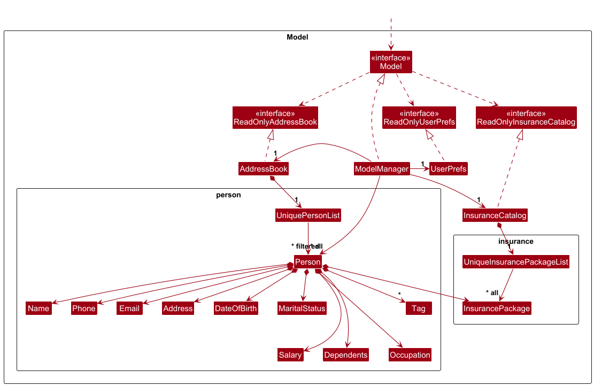
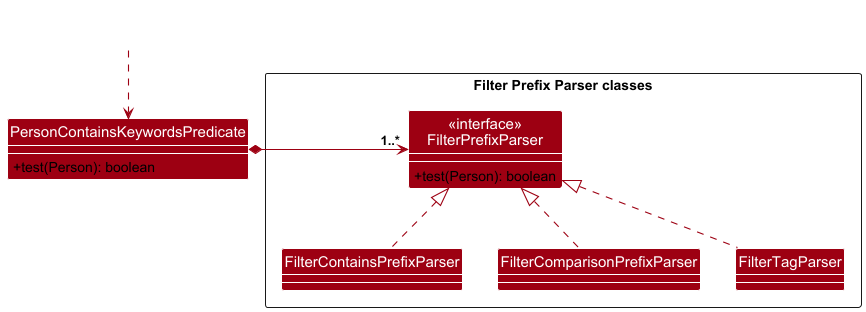
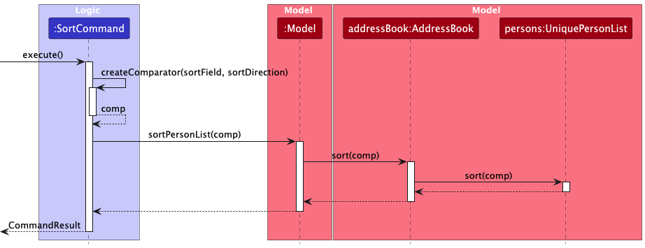
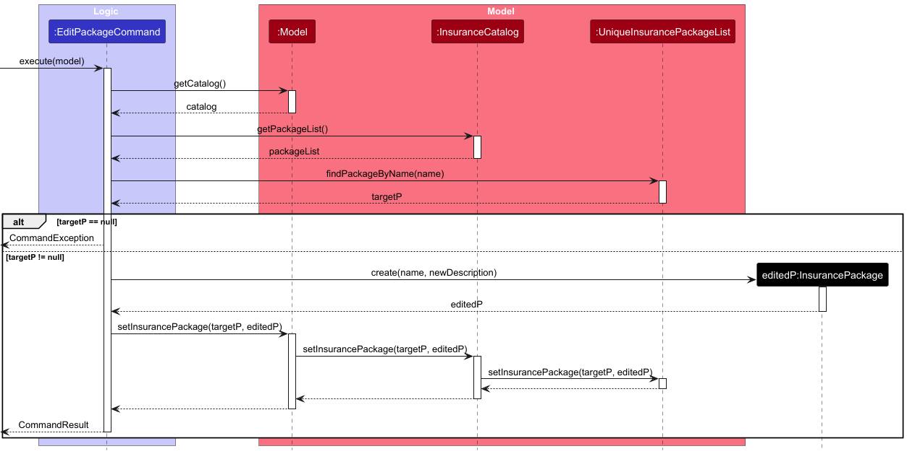

* Table of Contents
{:toc}

--------------------------------------------------------------------------------------------------------------------

## **Acknowledgements**

* Salary.java, line 31, regex for validating salary adapted from https://stackoverflow.com/questions/50524080/regex-with-maximum-2-digits-after-the-decimal-point.
* Occupation.java, line 19, regex for validating non-blank strings adapted from https://stackoverflow.com/questions/13750716/what-does-regular-expression-s-s-do.

--------------------------------------------------------------------------------------------------------------------

## **Setting up, getting started**

Refer to the guide [_Setting up and getting started_](SettingUp.md).

--------------------------------------------------------------------------------------------------------------------

## **Design**

:bulb: **Tip:** The `.puml` files used to create diagrams are in this document `docs/diagrams` folder. Refer to the [_PlantUML Tutorial_ at se-edu/guides](https://se-education.org/guides/tutorials/plantUml.html) to learn how to create and edit diagrams.

### Architecture

The ***Architecture Diagram*** given above explains the high-level design of the App.

Given below is a quick overview of main components and how they interact with each other.

**Main components of the architecture**

**`Main`** (consisting of classes [`Main`](https://github.com/se-edu/addressbook-level3/tree/master/src/main/java/seedu/address/Main.java) and [`MainApp`](https://github.com/se-edu/addressbook-level3/tree/master/src/main/java/seedu/address/MainApp.java)) is in charge of the app launch and shut down.
* At app launch, it initializes the other components in the correct sequence, and connects them up with each other.
* At shut down, it shuts down the other components and invokes cleanup methods where necessary.

The bulk of the app's work is done by the following four components:

* [**`UI`**](#ui-component): The UI of the App.
* [**`Logic`**](#logic-component): The command executor.
* [**`Model`**](#model-component): Holds the data of the App in memory.
* [**`Storage`**](#storage-component): Reads data from, and writes data to, the hard disk.

[**`Commons`**](#common-classes) represents a collection of classes used by multiple other components.

**How the architecture components interact with each other**

The *Sequence Diagram* below shows how the components interact with each other for the scenario where the user issues the command `delete 1`.

Each of the four main components (also shown in the diagram above),

* defines its *API* in an `interface` with the same name as the Component.
* implements its functionality using a concrete `{Component Name}Manager` class (which follows the corresponding API `interface` mentioned in the previous point.

For example, the `Logic` component defines its API in the `Logic.java` interface and implements its functionality using the `LogicManager.java` class which follows the `Logic` interface. Other components interact with a given component through its interface rather than the concrete class (reason: to prevent outside component's being coupled to the implementation of a component), as illustrated in the (partial) class diagram below.

The sections below give more details of each component.

### UI component

The **API** of this component is specified in [`Ui.java`](https://github.com/se-edu/addressbook-level3/tree/master/src/main/java/seedu/address/ui/Ui.java)

The UI consists of a `MainWindow` that is made up of parts e.g.`CommandBox`, `ResultDisplay`, `PersonListPanel`, `StatusBarFooter` etc. All these, including the `MainWindow`, inherit from the abstract `UiPart` class which captures the commonalities between classes that represent parts of the visible GUI.

The `UI` component uses the JavaFx UI framework. The layout of these UI parts are defined in matching `.fxml` files that are in the `src/main/resources/view` folder. For example, the layout of the [`MainWindow`](https://github.com/se-edu/addressbook-level3/tree/master/src/main/java/seedu/address/ui/MainWindow.java) is specified in [`MainWindow.fxml`](https://github.com/se-edu/addressbook-level3/tree/master/src/main/resources/view/MainWindow.fxml)

The `UI` component,

* executes user commands using the `Logic` component.
* listens for changes to `Model` data so that the UI can be updated with the modified data.
* keeps a reference to the `Logic` component, because the `UI` relies on the `Logic` to execute commands.
* depends on some classes in the `Model` component, as it displays `Person` object residing in the `Model`.

### Logic component

**API** : [`Logic.java`](https://github.com/se-edu/addressbook-level3/tree/master/src/main/java/seedu/address/logic/Logic.java)

Here's a (partial) class diagram of the `Logic` component:

The sequence diagram below illustrates the interactions within the `Logic` component, taking `execute("delete 1")` API call as an example.

:information_source: **Note:** The lifeline for `DeleteCommandParser` should end at the destroy marker (X) but due to a limitation of PlantUML, the lifeline continues till the end of diagram.

How the `Logic` component works:

1. When `Logic` is called upon to execute a command, it is passed to an `AddressBookParser` object which in turn creates a parser that matches the command (e.g., `DeleteCommandParser`) and uses it to parse the command.
1. This results in a `Command` object (more precisely, an object of one of its subclasses e.g., `DeleteCommand`) which is executed by the `LogicManager`.
1. The command can communicate with the `Model` when it is executed (e.g. to delete a person). 
   Note that although this is shown as a single step in the diagram above (for simplicity), in the code it can take several interactions (between the command object and the `Model`) to achieve.
1. The result of the command execution is encapsulated as a `CommandResult` object which is returned back from `Logic`.

Here are the other classes in `Logic` (omitted from the class diagram above) that are used for parsing a user command:

How the parsing works:
* When called upon to parse a user command, the `AddressBookParser` class creates an `XYZCommandParser` (`XYZ` is a placeholder for the specific command name e.g., `AddCommandParser`) which uses the other classes shown above to parse the user command and create a `XYZCommand` object (e.g., `AddCommand`) which the `AddressBookParser` returns back as a `Command` object.
* All `XYZCommandParser` classes (e.g., `AddCommandParser`, `DeleteCommandParser`, ...) inherit from the `Parser` interface so that they can be treated similarly where possible e.g, during testing.

### Model component
**API** : [`Model.java`](https://github.com/se-edu/addressbook-level3/tree/master/src/main/java/seedu/address/model/Model.java)

The `Model` component,

* stores the address book data i.e., all `Person` objects (which are contained in a `UniquePersonList` object).
* stores the currently 'selected' `Person` objects (e.g., results of a search query) as a separate _filtered_ list which is exposed to outsiders as an unmodifiable `ObservableList<Person>` that can be 'observed' e.g. the UI can be bound to this list so that the UI automatically updates when the data in the list change.
* stores a `UserPref` object that represents the user’s preferences. This is exposed to the outside as a `ReadOnlyUserPref` objects.
* does not depend on any of the other three components (as the `Model` represents data entities of the domain, they should make sense on their own without depending on other components)

### Storage component

**API** : [`Storage.java`](https://github.com/se-edu/addressbook-level3/tree/master/src/main/java/seedu/address/storage/Storage.java)

The `Storage` component,
* can save both address book data and user preference data in JSON format, and read them back into corresponding objects.
* inherits from both `AddressBookStorage` and `UserPrefStorage`, which means it can be treated as either one (if only the functionality of only one is needed).
* depends on some classes in the `Model` component (because the `Storage` component's job is to save/retrieve objects that belong to the `Model`)

### Common classes

Classes used by multiple components are in the `seedu.address.commons` package.

--------------------------------------------------------------------------------------------------------------------

## **Implementation**

This section describes some noteworthy details on how certain features are implemented.

### Adding more fields for Add/Edit

### Filter

The `filter` command's ability to handle multiple, complex criteria is enabled by `FilterCommandParser` and 
a hierarchy of specialized `FilterPrefixParser` classes. A single, composite `PersonContainsKeywordsPredicate` is used to
combine the various filtering criteria. This predicate is the main driver for `FilterCommand#execute(model)`
in updating the `filteredPersonsList`. 

The `FilterCommandParser`uses `ArgumentTokenizer` to produce an `ArgumentMultimap`, mapping each prefix
to its corresponding argument from the user's input. The `parse` method in `FilterCommandParser` then
determines which prefixes have been provided and instantiates the appropriate parser for each one.

Unlike a simple keyword search, the `filter` command supports different matching logic for different fields.
This is handled by a family of `FilterPrefixParser` classes:

1. `FilterContainsPrefixParser`: Performs a case-insensitive `contains` search. This is used for most
    text-based fields such as name, address and email.
2. `FilterComparisonPrefixParser`: Handles numerical fields (`s/` and `dep/`). It can perform a `contains`
    search by default, or a strict numerical comparison if an operator (`>`, `>=`, `<`, `<=`, `=`)
    is provided.
3. `FilterTagParser`: A specialized parser to handle the logic for matching tags, including support for
    multiple `t/` prefixes.

Each of these parsers is responsible for parsing the user's keyword and implementing a `test(Person)` 
method for its specific logic.
 

The `PersonContainsKeywordsPredicate` holds a list of these initialized `FilterPrefixParser` instances.
Its `test(Person)` method iterates through this list, calling the `test` method of each 
individual parser. It returns `true` only if the person object passes the test for **all** the provided 
criteria, thus achieving the **"AND"** logic.

#### Design Considerations:

**Parser Implementation** 
The `FilterCommandParser` was implemented in this manner to accommodate the `filter` command's diverse 
field types and logic. Instead of a single parsing strategy, it delegates the parsing and testing logic 
for each prefix to a specialized `FilterPrefixParser`. This makes it easy to manage different validation 
rules (e.g. contains vs. numerical comparison) for each field.

**Predicate Implementation** 
The `Model` requires a single `Predicate` to update its filtered list. Thus, `PersonContainsKeywordsPredicate` 
was designed to serve as a composite predicate. It holds multiple `FilterPrefixParser` instances, each 
representing a single filter criterion. This approach keeps the testing logic for each criterion separate and 
modular while providing a unified interface to the `Model`.

The sequence diagram below illustrates the interactions of `filter` within the `Logic` component, 
taking `execute("filter s/>=3000 ip/undecided")` API call as an example.

:information_source: **Note:** The lifeline for `FilterCommandParser` should end at the destroy
marker (X) but due to a limitation of PlantUML, the lifeline continues till the end of diagram.

The sequence diagram below represents the reference frame in the above sequence diagram.

:information_source: **Note:** Due to a limitation of PlantUML, it is possible to show the ref frame box but
not the sd frame box.

**Alternatives Considered:**
* **Alternative 1 (current choice):** A composite predicate that uses specialized prefix parsers.
  * Pros: Highly modular and extensible. Adding a new filterable field or a new type of filtering logic
    (e.g., date range filtering) only requires creating a new FilterPrefixParser subclass without
    modifying existing ones.
  * Cons: Introduces a slightly higher number of classes and a layer of abstraction with the parser hierarchy.
* **Alternative 2:** A single, monolithic predicate for all fields.
  * Pros: Fewer classes might seem simpler at first glance. 
  * Cons: The test method would become a large, complex block of if-else statements for each possible prefix.
  This would be difficult to read, maintain, and test, violating the Single Responsibility Principle.

### Sort
The `sort` command, facilitated by `SortCommand` and `SortCommandParser`, allows users to sort and display their client 
list by various fields (name, phone, email, address, salary, date of birth, marital status, occupation, dependents, insurance package) 
in ascending or descending order. 
Special handling ensures that "Unspecified" values are always placed at the bottom of the sorted list regardless of sort direction.

**Aspect: How sort executes:**

The sequence diagram below illustrates the interactions within the system when executing a `sort name ascending` command:

**Design Considerations:**

**Aspect: How unspecified values are handled:**

* **Current choice:** Always place "Unspecified" values at the bottom regardless of sort direction.
    * **Pros:** Consistent user experience; important data (specified values) always appears first.
    * **Cons:** May not follow strict alphabetical/numerical order in some cases.

* **Alternative:** Treat "Unspecified" as a regular string/value in sorting.
    * **Pros:** Maintains strict sorting order.
    * **Cons:** "Unspecified" values might appear in the middle of results, making it harder to focus on actual data.

### List Insurance Packages

The listing of insurance packages is facilitated by the `ListPackageCommand` and `PackageWindow` class.

The `ListPackageCommand` requires no input parsing as it takes no parameters. 
When `Command#execute` is called, `ListPackageCommand` creates a `CommandResult` with the `showPackage` flag set to `true` and provides feedback message "Opened package window." to the user.
The `MainWindow#executeCommand` detects this flag and calls `handlePackage()` to open a separate `PackageWindow` that displays all available insurance packages from the `Model#getFilteredInsurancePackageList()` method,
allowing users to view the complete catalog of insurance packages with their names and descriptions.

### Add/Edit/Delete Insurance Package

These three commands (`addp`, `editp`, `deletep` respectively) are parsed by a central `PackageCommandParser` before they are executed.

`PackageCommandParser` parses the input to obtain the package name and description using the `ip/` and `d/` prefixes respectively.
For `addp` and `editp`, the parser tokenizes the arguments and validates that both required prefixes are present.
For `deletep`, the parser only validates the package name using the `ip/` prefix.
The parser also validates that there is no preamble text before the prefixes and that the required prefixes are not duplicated.

**Add Insurance Package**
The addition of insurance packages is further facilitated by the `AddPackageCommand` and `InsurancePackage` classes.

After parsing, an `InsurancePackage` object is created with the parsed values. The `InsurancePackage` constructor automatically formats the package name to capitalize each word for consistency. 

When `Command#execute` is called, `AddPackageCommand` first checks for duplicate packages using `Model#hasInsurancePackage()` method. If no duplicate exists, it adds the new insurance package to the catalog via the `Model#addInsurancePackage()` method, which stores it in the `UniqueInsurancePackageList` in `InsuranceCatalog`.

**Edit Insurance Package**

The editing of insurance packages is further facilitated by the `EditPackageCommand` and `InsurancePackage` classes.

After parsing, the target package name and new description are stored in the `EditPackageCommand` object.

When `Command#execute` is called, `EditPackageCommand` first searches for the original package `targetPackage` by its name (case-insensitively). If this package is not found, a `CommandException` is thrown. If found, a new `InsurancePackage` object `editedInsurancePackage` is created using the original name and the new description. The `InsurancePackage` constructor automatically formats the package name for consistency. 
Finally, the command calls `Model#setInsurancePackage()` to replace the `targetPackage` with the `editedInsurancePackage` in the `UniqueInsurancePackageList` in `InsuranceCatalog`.

**Aspect: How editp executes:**

The sequence diagram below illustrates the interactions within the system when executing a `editp ip/packageName d/newDescription` command:

**Design Considerations:**

**Aspect: Identifying the target insurance package:**

* **Current choice:** Use a case-insensitive package name match.
    * **Pros:** More user-friendly and forgiving since users do not have to worry about exact casing, so fast typists are not slowed down.
    * **Cons:** Requires careful handling in `UniqueInsurancePackageList` to avoid duplicate names differing only by case.

* **Alternative:** Use a case-sensitive package name match.
    * **Pros:** Allows for better data specificity due to a stricter uniqueness constraint.
    * **Cons:** Less user-friendly as users must remember exact casing, which can be frustrating for fast typists.

**Delete Insurance Package**

--------------------------------------------------------------------------------------------------------------------

## **Documentation, logging, testing, configuration, dev-ops**

* [Documentation guide](Documentation.md)
* [Testing guide](Testing.md)
* [Logging guide](Logging.md)
* [Configuration guide](Configuration.md)
* [DevOps guide](DevOps.md)

--------------------------------------------------------------------------------------------------------------------

## **Appendix: Requirements**

### Product scope

**Target user profile**:

* works as a Financial Advisor professionally
* has a need to manage a significant number of clients and contacts
* wants to store clients' profile to get applicable financial plans for them
* prefer desktop apps over other types
* can type fast
* prefers typing to mouse interactions
* is reasonably comfortable using CLI apps

**Value proposition**: help Financial Advisors to manage many contacts faster than a typical mouse/GUI driven app

### User stories

Priorities: High (must have) - `* * *`, Medium (nice to have) - `* *`, Low (unlikely to have) - `*`

| Priority | As a …​                                                         | I want to …​                                                                            | So that I can…​                                                                                               |
|----------|-----------------------------------------------------------------|-----------------------------------------------------------------------------------------|---------------------------------------------------------------------------------------------------------------|
| `* * *`  | Financial Advisor                                               | store detailed client profiles (including salary, age, date of birth, occupation, etc.) | quickly assess which insurance plans are best suited for which client                                         |
| `* * *`  | Financial Advisor                                               | edit my client's data                                                                   | update their details if there is any change                                                                   |
| `* * *`  | Financial Advisor                                               | archive or delete old clients                                                           | remove entries that I no longer need                                                                          |
| `* * *`  | Financial Advisor                                               | assess the application offline                                                          | work without internet connection.                                                                             |
| `* * *`  | Financial Advisor                                               | add a new client profile with key financial details                                     | provide personalized recommendations later.                                                                   |
| `* * *`  | Financial Advisor                                               | safely store and access sensitive customer data since it is a remote application        | not worry about data beaches                                                                                  |
| `* * *`  | Financial Advisor                                               | quickly search for clients based on their names                                         | get their data quickly                                                                                        |
| `* * *`  | Financial Advisor                                               | export all of my client data to a CSV file                                              | create backups of my client information for safekeeping                                                       |
| `* * *`  | Financial Advisor                                               | quickly view a client by typing their name                                              | access their information faster than scrolling through a long list                                            |
| `* * *`  | Financial Advisor                                               | sort my list based on category (name, income level, age, etc.)                          | quickly identify clients at the bottom or top of a category                                                   |
| `* * *`  | Financial Advisor                                               | filter my client list based on specific criteria (age range, income level)              | quickly assess which insurance plans are best suited for which client                                         |
| `* *`    | Financial Advisor                                               | tag them with custom labels                                                             | include information that is unique to each client and does not fall into any of the predetermined categories. |
| `* *`    | Financial Advisor that is new to the system                     | see sample client profiles when I open the app                                          | quickly understand how information is structured and stored                                                   |
| `* *`    | Financial Advisor ready to use the system in my day to day work | delete all samples and test data/start a clean account for myself                       | input real client information.                                                                                |
| `* *`    | Financial Advisor                                               | add custom insurance packages to the system with custom name and descriptions           | offer personalized insurance options that aren't in the default catalog                                       |
| `* *`    | Financial Advisor                                               | edit the descriptions of existing insurance packages                                    | update package information with the latest details and provide accurate details to clients                    |
| `* *`    | Financial Advisor                                               | view all available insurance packages in the system                                     | see what options I can offer to my clients                                                                    |
| `* *`    | Financial Advisor                                               | remove outdated insurance packages from the system                                      | adapt to new insurance products while removing outdated insurance packages                                    |
| `*`      | Financial Advisor with many package options                     | prevent duplicate package names in the system                                           | avoid confusion when selecting packages for clients                                                           |
| `*`      | Financial Advisor managing a clean system                       | be prevented from deleting essential default packages                                   | ensure the catalog always has basic package options available                                                 |

### Use cases

(For all use cases below, the **System** is the `ClientCore` and the **Actor** is the `FA`, unless specified otherwise)

**Use case: U1. Delete a client**

**Precondition:** FA is logged into the app

**MSS**

1.  FA requests to list the clients
2.  ClientCore shows a list of clients
3.  FA requests to delete a specific client in the list
4.  ClientCore deletes the client

    Use case ends.

**Extensions**

* 2a. The list is empty.

  Use case ends.

* 3a. The given index is invalid.

    * 3a1. ClientCore shows an error message.

      Use case resumes at step 2.

**Use case: U2. Find a client**

**Precondition:** FA is logged into the app

**MSS**

1.  FA requests to list clients
2.  ClientCore shows a list of clients
3.  FA requests to find a list of clients containing the input keyword.
4.  ClientCore finds and shows a new list of clients with matching names.

    Use case ends.

**Extensions**

* 2a. The list is empty.

  Use case ends.

* 3a. The given name is invalid.

    * 3a1. ClientCore shows an error message.

      Use case resumes at step 2.
  
* 3b. The given name does not match with anyone.

    * 3b1. ClientCore shows a message stating no one is found.
      
      Use case ends.

**Use case: U3. View a client's full detail**

**Precondition:** FA is logged into the app

**MSS**

1.  FA requests to list clients
2.  ClientCore shows a list of clients
3.  FA requests to view a specific client in the list.
4.  ClientCore shows the client's full detail in a new window.

    Use case ends.

**Extensions**

* 2a. The list is empty.

  Use case ends.

* 3a. The given index is invalid.

    * 3a1. ClientCore shows an error message.

      Use case resumes at step 2.

* 3b. The given name is invalid.

    * 3b1. ClientCore shows an error message.

      Use case resumes at step 2.

* 3c. The given name matches with 2 or more client

    * 3c1. ClientCore shows an error message and 
           prompt FA to view based on index instead of name.

      Use case resumes at step 2.

**Use case: U4. Filter list of clients**

**Precondition:** FA is logged into the app

**MSS**

1.  FA requests to list clients
2.  ClientCore shows a list of clients
3.  FA requests to filter the list based on input field.
4.  ClientCore shows the filtered list.

    Use case ends.

**Extensions**

* 2a. The list is empty.

  Use case ends.

* 3a. The given input field does not exist.

    * 3a1. ClientCore shows an error message.

      Use case resumes at step 2.

* 3b. The given input contains duplicate field.

    * 3b1. ClientCore shows an error message.

      Use case resumes at step 2.
  
* 3c. The given input does not match with anyone.

    * 3c1. ClientCore shows a message stating no one is found.
  
      Use case ends.

**Use case: U5. Tag a client into groups**

**Precondition:** 

1. FA is logged into the app
2. Target client is in the list

**MSS**

1.  FA requests to list clients
2.  ClientCore shows a list of clients
3.  FA requests to tag a specific client in the list.
4.  ClientCore tag the client and group them with similar tags.

    Use case ends.

**Extensions**

* 2a. The list is empty.

  Use case ends.

* 3a. The given tag input is invalid

    * 3a1. ClientCore shows an error message.

      Use case resumes at step 2.

* 4a. The given tag is a newly created tag
    
    * 4a1. ClientCore tells FA that the tag is new and the
	   tagged client is the first one in the group.

      Use case ends.

**Use case: U6. Sort a client based on a category**

**Precondition:**

1. FA is logged into the app
2. The list contains 2 or more client

**MSS**

1.  FA requests to list clients
2.  ClientCore shows a list of clients
3.  FA requests to sort clients based on existing category, stating ascending/descending
4.  ClientCore sorts the list based on FA's input.

    Use case ends.

**Extensions**

* 2a. The list is empty.

  Use case ends.

* 3a. The given input is not based on existing category.
      
    * 3a1. ClientCore shows an error message that says category doesn't exist.

      Use case resumes at step 2.

* 3b. FA does not specify ascending or descending.
  
    * 3b1. ClientCore automatically infer it as ascending and sort ascendingly.

      Use case ends.

**Use case: U7. Adding an insurance package**

**Precondition:** FA is logged into the app

**MSS**

1. FA requests to add a new package with a name and description.
2. ClientCore adds the new package and update the list of packages.

    Use case ends.

**Extensions**

* 1a. The name matches with an existing package.

    * 1a1. ClientCore shows an error message.
  
      Use case resumes at step 1.

* 1b. FA does not want to include a description.

    * 1b1. ClientCore accepts the package and leave the description blank.

      Use case ends.

**Use case: U8. Deleting an insurance package**

**Precondition:**

1. FA is logged into the app.
2. The package list contains 1 or more package.

**MSS**

1. FA requests to list packages.
2. ClientCore shows the list of packages.
3. FA requests to delete one of the packages.
4. ClientCore deletes the package and removes it from the list of packages.

   Use case ends.

**Extensions**

* 3a. FA tries to delete a default package.

    * 3a1. ClientCore cancels the action and state that default packages cannot be deleted.

      Use case resumes at step 2.

* 3b. The given name does not match with any packages.

    * 3b1. ClientCore shows an error message.
  
      Use case resumes at step 2.

*{More to be added}*

### Non-Functional Requirements

#### Platform Compatibility
1.  Should work on any _mainstream OS_ (Windows, Linux, Unix, MacOS) as long as it has Java `17` or above installed.

#### Performance and Responsiveness
2. The application should load up in under 3 seconds for a dataset of 1,000 persons.
3. All commands (`list`, `filter`, `sort`, etc.) should return results in under 1.5 seconds for a dataset of 1,000 
persons.

#### Scalability 
4. The system should be designed to scale to larger datasets (e.g., ≥10,000 contacts) with minimal architectural changes
(less than 10% of the codebase's functional code).

#### Usability 
5. A user with above average typing speed for regular English text (i.e. not code, not system admin commands) 
should be able to accomplish most of the tasks (e.g. adding, editing or finding a contact) faster using commands than
using the mouse.
6. Commands should be deterministic in their expected behaviour.
7. Error messages should be clear, instructive, and suggest corrective action.

#### Reliability and Fault Tolerance 
8. The application must not crash in the event of invalid inputs. 
9. The application must be able to handle unexpected shutdowns without loss of stored data. 

#### Security and Privacy 
10. All client data is stored locally on the user's file system and is not transmitted over any network, giving the user
full control over their data's security.
11. The application must comply with all data privacy regulations that the user is bound to.

#### Maintainability 
12. Code must be modular and follow the standard Java conventions outlined by the CS2103T course.
13. The project build should be automated via Gradle. 
14. Unit and integration tests must provide ample (>80%) coverage of the codebase's functional code. 

#### Extensibility 
15. The system should support the addition of new commands without modification to the core Logic or Model interfaces.

#### Portability 
16. The application should be distributable as a single JAR file and run consistently across all
supported platforms (Windows, Linux, Unix, MacOS) without requiring external dependencies. 

#### Documentation
17. The User Guide should be able to clearly explain all commands to a CLI novice. 
18. The Developer Guide should include instructions for setting up the development environment.
19. Most of the public classes and methods in the codebase (>80%) should include JavaDoc header comments that describe 
its purpose, parameters, return values, and any exceptions thrown. These comments should follow the official JavaDoc 
conventions outlined by the CS2103T course.

### Glossary

* **Mainstream OS**: Windows, Linux, Unix, MacOS
* **Command Line Interface (CLI)**: A text-based interface where the user types commands instead of 
graphical elements.
* **Financial Advisor (FA)**: A professional user of the system whose job is to manage client 
relationships and recommend suitable financial products or services.
* **Client**: An individual whose personal and financial details (e.g., age, salary, policies, risk profile) 
are stored in the system. Clients are the primary focus of the Financial Advisor’s work and the main type of
contact being managed.
* **Client Profile**: A structured record containing personal and financial information of a client (name, 
age, salary, relationship status, etc.).
* **Tag**: A label applied to a client profile which provides additional information about a client.
* **Command**: A typed instruction given to the system to perform an action (e.g. list, add, find, delete).
* **Prefix**: A two-or-three letter code followed by a / (e.g., n/, p/, ip/) used in commands to specify which data 
field the user wants to work with.
* **Parameter**: The value provided by the user after a prefix. E.g. in the partial command `add n/John Doe`, 
John Doe is the parameter for the n/ prefix.
* **Case-Insensitive**: A type of search or comparison that ignores the difference between uppercase and lowercase
letters. E.g. a case-insensitive search for john would match john, John, and jOhN.
* **Operator**: A symbol (>, >=, <, <=, =) used in the filter command to perform numerical or date-based comparisons,
allowing for more advanced queries beyond simple keyword matching.
* **CSV (Comma-Separated Values)**: A plain text file format used for the export feature. Each line in the file 
represents a row of data, with values separated by commas. CSV files are widely compatible with spreadsheet software
like Microsoft, Excel or Google Sheets.
* **Index**: A 1-based number corresponding to the position of a client in the currently displayed list. It is used by 
commands like `edit` and `delete` to identify a specific client.
* **JSON (JavaScript Object Notation)**: A lightweight, human-readable text format used to store the application's data,
such as client profiles and user preferences.
* **Field**: The term used in the application to refer to a specific piece of data within a client profile, such as 
`Name`, `Phone`, or `Salary`.
* **Insurance Package**: Represents a specific financial product or plan that can be assigned to a client. 
Each package has a unique name and a description.

--------------------------------------------------------------------------------------------------------------------

## **Appendix: Instructions for manual testing**

Given below are instructions to test the app manually.

:information_source: **Note:** These instructions only provide a starting point for testers to work on;
testers are expected to do more *exploratory* testing.

### Launch and shutdown

1. Initial launch

   1. Download the jar file and copy into an empty folder

   1. Double-click the jar file Expected: Shows the GUI with a set of sample contacts. The window size may not be optimum.

1. Saving window preferences

   1. Resize the window to an optimum size. Move the window to a different location. Close the window.

   1. Re-launch the app by double-clicking the jar file. 
       Expected: The most recent window size and location is retained.

1. _{ more test cases …​ }_

### Deleting a person

1. Deleting a person while all persons are being shown

   1. Prerequisites: List all persons using the `list` command. Multiple persons in the list.

   1. Test case: `delete 1` 
      Expected: First contact is deleted from the list. Details of the deleted contact shown in the status message. Timestamp in the status bar is updated.

   1. Test case: `delete 0` 
      Expected: No person is deleted. Error details shown in the status message. Status bar remains the same.

   1. Other incorrect delete commands to try: `delete`, `delete x`, `...` (where x is larger than the list size) 
      Expected: Similar to previous.

1. _{ more test cases …​ }_

### Saving data

1. Dealing with missing/corrupted data files

   1. _{explain how to simulate a missing/corrupted file, and the expected behavior}_

1. _{ more test cases …​ }_
